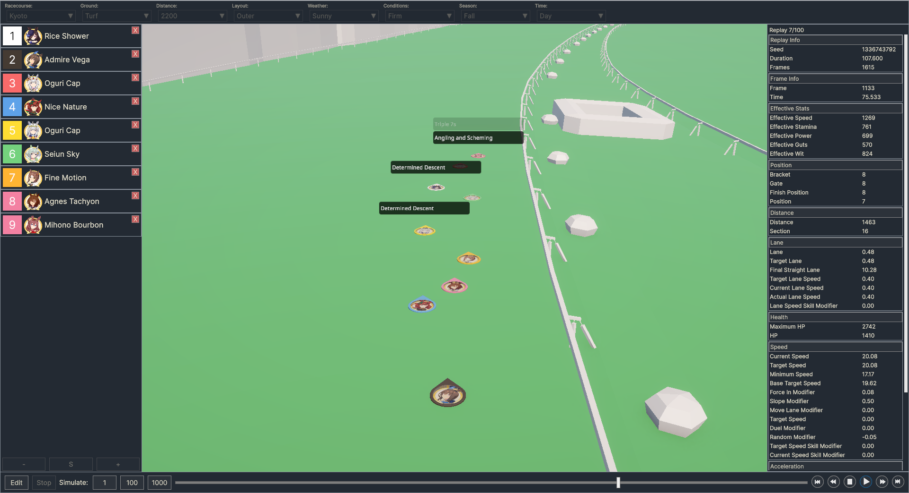

# Moirai - Umamusume Race Simulator

Moirai is an Umamusume race simulator, based on the mechanics discovered by fans and documented by KuromiAK in [this Google doc](https://docs.google.com/document/d/15VzW9W2tXBBTibBRbZ8IVpW6HaMX8H0RP03kq6Az7Xg/). It is not a perfect emulation of Umamusume race mechanics, there are mistakes in implementation and missing features, but it should be a more accurate predictor of a runner's success than other online "umalators" which do not simulate lane movement, position, blocking, vision, distance loss on corners, multiple runners, among many other things.

Some hotkeys: 
`Tab` - Open/close stats window 
`<` - Decrease playback speed  
`>` - Increase playback speed  
`,` - Back one frame  
`.` - Forward one frame  

## Features

* Simulates characters, skills, and features in the current global version of the game, except where noted below.
* Edit stats, aptitudes, and skills for 1--18 Umamusume.
* Run batches of up to 1000 race simulations and cycle through and watch generated replays.
* View statistics such as win rates and full spurt rates for each runner.
* Calculates ratings so open league players can predict their ratings before buying skills and completing a career.

## Future Work

* **Power Conservation/Fully Charged system**. Details of how this works are unknown to the race mechanics Google doc.
* **1.5th Anniversary changes to position keep**. Details also unknown.
* **Teams**. Currently, skills like *Ignited Spirit: Speed* grant your runner the maximum bonus. Debuffs can target anyone.
* **Popularity**. Skills like *Long Shot* and *Laugh at the Odds* that depend on favourites to win all assume for now that the skill owner is the No. 1 favourite.
* **Mood**. All runners are assumed to be in a great mood. It will be easy to make this configurable.
* **Unique skill levels**. Skill levels can be selected in the runner editor window, but this only affects the rating calculation and does not yet buff the skill during simulation.
* **Skill heat graph** and **skill usage statistics**. It would be nice to see where and how often your skills are activated. 
* **Visualizations of zones** like where corners, hills, phases, and sections start and end.
* **Saving and loading** individual runners to and from disk.
